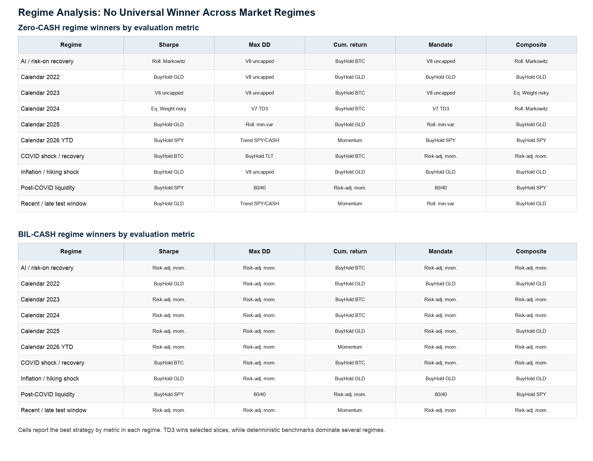

# Robust Evaluation of TD3 Portfolio Allocation under Realistic Cross-Asset Frictions

**Subtitle / alternative framing:** A Cross-Asset Reality Check under Costs, Cash, and Statistical Validation

## Abstract

This paper evaluates whether Twin Delayed Deep Deterministic Policy Gradient (TD3) remains credible for dynamic portfolio allocation once realistic financial evaluation conditions are imposed simultaneously. The experiment uses a compact cross-asset wealth-allocation universe consisting of SPY, TLT, GLD, BTC-USD, and CASH, with weekly long-only allocation, asset-specific transaction costs, explicit Zero-CASH and BIL-CASH assumptions, where BIL-CASH is a short-term Treasury ETF proxy for remunerated cash, regenerated deterministic benchmarks, and out-of-sample walk-forward evaluation. The empirical design separates candidate ranking from statistical validation through bootstrap Sharpe-difference tests and a White Reality Check over the searched TD3 candidate set. Additional robustness layers evaluate mandate and Pareto feasibility, regime dependence, execution-spread stress, and training-budget convergence.

The corrected evidence does not support a claim that TD3 statistically dominates clean portfolio benchmarks. TD3 remains competitive and can rank first under the combined TD3-plus-benchmark ranking layer, but bootstrap confidence intervals include zero and White Reality Check p-values do not reject benchmark competitiveness. Cash assumptions, transaction costs, execution spreads, and hard mandate filters materially affect model selection and interpretation. The contribution is therefore not a deployable alpha claim or an algorithmic contribution, but a falsification-oriented evaluation framework showing how much DRL portfolio claims depend on benchmark, cash, cost, and statistical validation discipline.

## Introduction

Deep reinforcement learning (DRL) is attractive for portfolio allocation because it can represent dynamic, nonlinear decision rules without requiring a closed-form forecasting model. In principle, a continuous-control agent can adapt allocations across asset classes, respond to changing risk conditions, and incorporate transaction costs directly into the portfolio environment. In practice, however, financial DRL results are vulnerable to fragile evaluation. Apparent performance can depend on weak benchmarks, simplified trading costs, unclear cash treatment, unstable concentration behavior, limited robustness analysis, or the absence of data-snooping controls.

This paper asks whether TD3 portfolio allocation benefits survive a realistic cross-asset evaluation once costs, cash assumptions, benchmarks, statistical validation, mandate constraints, regimes, execution frictions, and training-budget sensitivity are imposed simultaneously. The goal is not to market TD3 as a benchmark-beating strategy. The goal is to test whether TD3 remains credible after common objections to financial backtests are built into the protocol.

The central research question is:

> Do TD3 portfolio allocation benefits survive realistic cross-asset evaluation once costs, cash assumptions, benchmarks, statistical validation, mandate constraints, regimes, execution frictions, and training-budget sensitivity are imposed simultaneously?

The answer is deliberately qualified. TD3 remains competitive under the corrected protocol and can rank above regenerated deterministic benchmarks in the combined ranking layer. However, statistical validation does not establish superiority over clean benchmarks. This distinction is central: a high ranking under a diagnostic score is not the same as statistically reliable outperformance. The main empirical finding is therefore not a TD3 victory claim, but a narrowing of what can be responsibly claimed from TD3 portfolio experiments: ranking competitiveness can survive realistic evaluation, while statistical dominance does not.

The paper makes four contributions.

1. It develops a corrected TD3 evaluation protocol for a compact cross-asset wealth-allocation universe with asset-specific costs and explicit cash assumptions.
2. It compares TD3 variants against deterministic benchmarks regenerated under matching cost and cash assumptions.
3. It adds a statistical validation layer using bootstrap Sharpe differences and White Reality Check, explicitly separating ranking from statistical superiority.
4. It evaluates practical robustness through regime behavior, mandate and Pareto feasibility, execution-spread stress, and training-budget convergence.

The paper does not claim deployable investment advice or a production-ready trading system. Its contribution is a robust evaluation framework and a disciplined interpretation of DRL portfolio evidence.

## Related Literature and Research Gap

### DRL and TD3 for Portfolio Allocation

Portfolio allocation is a natural application of reinforcement learning because portfolio weights are sequential decisions and realized performance depends on the interaction between returns, costs, and previous allocations. Earlier portfolio theory formalized mean-variance tradeoffs, performance evaluation, and dynamic portfolio choice (Markowitz, 1952; Sharpe, 1966; Merton, 1969, 1971). DRL extends this setting by learning allocation rules from historical state variables rather than specifying a parametric return model.

TD3 is an established continuous-control actor-critic algorithm built on deterministic policy gradients, twin critics, delayed actor updates, target networks, and target policy smoothing (Silver et al., 2014; Lillicrap et al., 2015; Fujimoto et al., 2018). Its continuous-action structure is suitable for portfolio-weight decisions, but this paper does not treat TD3 as a methodological novelty. TD3 is the learning engine being evaluated, not the main contribution.

Prior work has already studied recurrent reinforcement learning for trading, model-free DRL portfolio management, FinRL-style trading frameworks, risk-aware portfolio rewards, correlation-aware DRL portfolio selection, and TD3 portfolio-selection models (Moody and Saffell, 2001; Jiang et al., 2017; Almahdi and Yang, 2017; Liu et al., 2020; Zhao et al., 2023; Jiang et al., 2024, 2025). The question here is narrower and more severe: whether a TD3 allocator remains credible when realistic evaluation layers are imposed together.

### Multi-Asset and Crypto/Gold Portfolio Allocation

The empirical universe is designed around a compact wealth-allocation problem under macro-financial uncertainty. At each rebalancing date, the allocation decision is not simply whether to hold more or less risky assets, but how to rotate capital across economically distinct sources of portfolio risk: equity growth exposure, interest-rate duration, real safe-haven exposure, digital alternative risk, and defensive liquidity. SPY, TLT, GLD, BTC-USD, and CASH are therefore used as liquid proxies for these five allocation sleeves. The universe is deliberately compact rather than exhaustive, so the behavior of the TD3 policy can be interpreted through economically meaningful risk categories rather than through a large opaque asset set.

Gold and Bitcoin have both been studied in portfolio, diversification, hedge, and safe-haven contexts, but the literature does not support treating Bitcoin as a simple substitute for gold (Bouri et al., 2017; Henriques and Sadorsky, 2018; Guesmi et al., 2019). They should not be treated as equivalent. Gold is a hard-asset and safe-haven proxy with a long institutional history. Bitcoin is a speculative digital alternative with high volatility, adoption risk, and idiosyncratic market structure. This paper includes both to test whether TD3 can allocate across distinct risk sleeves, not because Bitcoin is assumed to be digital gold.

### Transaction Costs, Constraints, and Cash in Portfolio Evaluation

Transaction costs and constraints are not implementation details in portfolio evaluation. A dynamic strategy with high turnover can look attractive before costs and fragile afterward. Similarly, a strategy forced to remain invested in risky assets has a different opportunity set from a strategy allowed to allocate defensively. Prior DRL portfolio work has incorporated transaction costs or risk-aware objectives, and machine-learning portfolio construction has also emphasized diversification and concentration control (Moody and Saffell, 2001; Almahdi and Yang, 2017; Chen et al., 2022; Jiang et al., 2024).

This paper makes cash explicit. The Zero-CASH protocol treats cash as a synthetic zero-return defensive sleeve. The BIL-CASH protocol replaces that assumption with a short-term Treasury ETF proxy and assigns a nonzero transaction cost. This design tests whether the cash assumption changes model selection. It also prevents the paper from hiding the opportunity cost of defensive allocation.

### Statistical Validation and Data-Snooping Controls

Financial model selection is vulnerable to data snooping. When many candidate policies are trained and evaluated, the best observed strategy may look strong because of the search process rather than because of a reliable economic edge. White's Reality Check directly addresses data-snooping risk, while Deflated Sharpe and related backtest-overfitting work motivate caution when interpreting searched strategy performance (White, 2000; Bailey and López de Prado, 2014; López de Prado, 2020).

This paper uses bootstrap Sharpe-difference intervals and White Reality Check p-values as statistical guardrails. These tests do not replace economic interpretation, but they prevent ranking results from being overstated as statistical dominance.

### Research Gap

TD3 portfolio allocation, transaction costs, macro or factor features, crypto portfolios, and benchmark comparisons have each been studied before. The contribution here is not the isolated use of any one component. The gap is the combined falsification-oriented evaluation stack.

This paper evaluates whether TD3 remains credible when asset-specific costs, explicit cash assumptions, regenerated benchmarks, statistical validation, mandate and Pareto feasibility, regime analysis, execution-spread stress, and training-budget convergence are imposed together in a realistic cross-asset protocol. That combined evaluation discipline is the main research contribution.

## Data and Asset Universe

The universe is deliberately compact, not exhaustive. It is designed to span economically distinct risk sleeves in a wealth-allocation problem while keeping allocation behavior interpretable. A larger universe would add realism, but it would also make it harder to diagnose whether TD3 is learning robust allocation behavior or exploiting a narrow historical artifact.

The allocation problem approximates a simplified global wealth-management decision: whether capital should be exposed to economic growth, long-duration bonds, real defensive assets, digital alternatives, or liquidity.

Table 1 summarizes the asset universe.

**Asset universe and economic risk sleeves**

| Asset | Economic role | Interpretation | Limitation |
| --- | --- | --- | --- |
| SPY | Equity / growth risk | Broad U.S. equity exposure and the main pro-cyclical growth sleeve. | U.S.-centric equity proxy; not a global equity portfolio. |
| TLT | Duration / interest-rate risk | Long-duration Treasury exposure that can hedge some equity drawdowns. | Not risk-free; vulnerable to rate shocks. |
| GLD | Hard asset / safe-haven proxy | Gold exposure used as hard-asset and crisis-hedge sleeve. | Not cash and not a complete commodity allocation. |
| BTC-USD | Digital alternative / speculative convexity | High-volatility alternative asset with asymmetric upside and idiosyncratic risk. | Not assumed to be digital gold; large drawdown and liquidity risk. |
| CASH | Defensive allocation / optionality / risk-free sleeve | Allows the policy to reduce risky exposure and preserve optionality. | Synthetic under Zero-CASH; BIL is only a proxy for investable cash. |

The universe is not a full global market portfolio. It does not include credit, real estate, broad commodities, international equities, taxes, custody costs, or investor-specific liabilities. TLT represents duration risk, not risk-free exposure. GLD and BTC-USD are treated as distinct risk sleeves. CASH is explicit because defensive allocation and opportunity cost are central to realistic wealth management.

Two cash protocols are used.

**Cash protocols**

| Protocol | Return assumption | Cost assumption | Interpretation |
| --- | --- | --- | --- |
| Zero-CASH | 0 return | 0 bps | Synthetic defensive sleeve used to isolate allocation behavior. |
| BIL-CASH | BIL proxy return | 2 bps | Short-term Treasury ETF proxy used as cash-assumption robustness. |

The two protocols are not interchangeable. They define different investable environments and therefore can produce different preferred TD3 specifications.

## Methodology

### Portfolio Environment

At each weekly decision date, the agent selects long-only portfolio weights over SPY, TLT, GLD, BTC-USD, and CASH. Weights are fully invested across the available sleeves, meaning they sum to one. This does not imply full exposure to risky assets because CASH is part of the investable universe.

Portfolio performance is measured after transaction costs. Let \(w_{t,i}^{target}\) be the target weight in asset \(i\) at week \(t\), \(w_{t,i}^{drifted}\) be the pre-trade drifted weight after market movement, \(r_{t,i}\) be the asset return, and \(c_i\) be the asset-specific transaction cost rate. The gross portfolio return is:

\[
R^{gross}_t = \sum_i w^{target}_{t,i} r_{t,i}
\]

The transaction cost is:

\[
C_t = \sum_i c_i |w^{target}_{t,i} - w^{drifted}_{t,i}|
\]

The net financial return is:

\[
R^{net}_t = R^{gross}_t - C_t
\]

The corrected cost schedule is asset-specific: SPY, TLT, and GLD use 2 bps; BTC-USD uses 10 bps; CASH uses 0 bps under Zero-CASH and 2 bps under BIL-CASH.

### TD3 Agent

The TD3 agent is a continuous-control actor-critic model. The actor maps state variables into portfolio weights. Twin critics reduce overestimation bias. The algorithm uses a replay buffer, target networks, target policy smoothing, delayed actor updates, and behavior-policy exploration during training. Evaluation is deterministic.

TD3 is not presented as novel. It is used because portfolio allocation is a continuous-action problem and because TD3 is a standard benchmark algorithm for deterministic continuous control.

### Feasible Action Handling

Portfolio actions are projected consistently before execution and storage so that the policy, environment, replay buffer, and critic updates operate on feasible weights. This is a methodological safeguard. It is not framed as a separate algorithmic contribution.

### Reward

The reward uses net financial return after full transaction costs and an active drawdown penalty:

\[
reward_t = R^{net}_t - drawdown\_penalty_t
\]

Transaction costs therefore affect both realized performance and the training signal. Turnover and concentration are not added as direct reward penalties. They are evaluated through transaction costs, max-weight caps, diagnostics, mandate profiles, and Pareto analysis. This separation is important because the paper does not train directly on the final custom evaluation scores.

### Feature Families

The experiment evaluates multiple TD3 feature families rather than one manually selected state representation. The objective is to test which independently trained state specification survives a common evaluation protocol.

**TD3 feature families**

| Candidate | Description | Role in experiment |
| --- | --- | --- |
| V2 reference | Broad reference financial state. | Baseline rich feature set for comparison. |
| V3 clean macro | Financial state plus clean real-time/as-of macro variables. | Tests whether audited macro information improves allocation. |
| V4 GARCH | Financial state plus fitted GARCH-style volatility features. | Tests volatility-forecast feature value. |
| V5 no-vol | Ablation excluding a volatility feature block. | Tests whether simpler non-volatility states remain competitive. |
| V6 financial | Parsimonious financial state with renamed score-like indicators. | Tests compact financial state representation. |
| V7 macro+GARCH | Clean no-DXY macro state plus GARCH features. | Tests whether GARCH improves the clean macro specification. |
| V8 EWMA/GARCH | EWMA/GARCH volatility hybrid. | Tests alternative volatility-state construction. |

Short candidate labels are used for readability; full feature-family identifiers are reported in the project outputs. The clean macro/as-of pipeline excludes DXY because a full-window fresh true-vintage dollar proxy is not available without fallback, discontinuation, or current-vintage relabeling. CPI year-over-year is computed before weekly alignment. Heuristic probability-like V6 features are treated as scores rather than calibrated probabilities. Mechanical duplicate features are removed. PCA was audited but is not used as the default state representation.

## Experimental Protocol

The final corrected protocol is moderate but systematic. It is designed to make TD3 compete against realistic frictions rather than against weak evaluation assumptions.

**Final corrected experimental protocol**

| Component | Design |
| --- | --- |
| Frequency | Weekly |
| Asset universe | SPY, TLT, GLD, BTC-USD, CASH |
| Allocation | Long-only, fully invested across available sleeves |
| Seeds | 10 in main corrected experiments |
| Folds | 4 |
| Episodes | 60 |
| TD3 histories per cash assumption | 800 |
| Benchmarks per cash assumption | 14 |
| Cash assumptions | Zero-CASH and BIL-CASH |
| Costs | Asset-specific transaction costs |
| Statistical validation | Bootstrap Sharpe differences and White Reality Check |
| Additional robustness | Regime analysis, mandate/Pareto feasibility, execution-spread stress, training-budget convergence |

The 800 histories per cash assumption should not be interpreted as 800 independent market samples. They share the same historical period, folds, and asset universe. Their purpose is to assess candidate, cap, seed, and fold behavior under a systematic evaluation protocol.

Because the project contains several reporting layers, the word "best" changes meaning across sections. Table 5 defines the layers and prevents ranking results from being confused with statistical or practical feasibility claims.

**Reporting layers and questions answered**

| Layer | Question answered | Main output | What it does not prove |
| --- | --- | --- | --- |
| TD3-only cap sensitivity | Which TD3 specification and cap performs best inside the TD3 universe? | Selected TD3 candidate by cash protocol. | It does not compare TD3 with deterministic benchmarks. |
| Combined TD3 + benchmark ranking | How do selected TD3 candidates rank against regenerated benchmarks under matching cost and cash assumptions? | Top combined TD3/benchmark ranking. | It does not establish statistical superiority. |
| Bootstrap / White Reality Check | Does the top searched TD3 candidate statistically outperform clean benchmarks? | Sharpe-difference intervals and WRC p-values. | It does not invalidate competitiveness; it rejects overclaiming. |
| Regime analysis | Is performance broad-based or regime-specific? | Regime-level winners and metric slices. | It does not prove all-weather dominance. |
| Mandate / Pareto analysis | Which strategies remain credible under hard constraints and multi-metric tradeoffs? | Mandate pass/fail and Pareto frontier results. | It does not make custom scores sufficient evidence. |
| Execution-spread robustness | How sensitive are selected histories to additional spread assumptions? | Return and Sharpe degradation under stress spreads. | It is not a new model-selection layer. |
| Training-budget convergence | Does the 60-episode budget look obviously undertrained? | Comparison across 30/60/100/150 episodes. | It does not prove the globally optimal training length. |

## Results

### TD3-Only Cap Sensitivity

The first result is evaluated within the TD3 candidate universe. This layer asks which TD3 variant and cap are strongest before deterministic benchmarks are introduced. It is useful for understanding policy behavior, but it is not evidence that TD3 beats benchmarks.

Under Zero-CASH, the TD3-only winner is V5 no-vol cap 0.50, with mandate-aware score 0.601124 and robust score 0.696702. Under BIL-CASH, the TD3-only winner is V8 EWMA/GARCH cap 0.70, with mandate-aware score 0.660435 and robust score 0.749958.

Mandate-aware and robust scores are diagnostic selection summaries. Financial interpretation relies primarily on standard metrics and statistical validation.

**TD3-only selected candidates and standard metrics**

| Cash assumption | Selected TD3 | Cap | Ann. return | Ann. volatility | Sharpe | Max drawdown | Avg. turnover | Eff. assets | Mean weekly transaction cost | Mandate-aware | Robust |
| --- | --- | ---: | ---: | ---: | ---: | ---: | ---: | ---: | ---: | ---: | ---: |
| Zero-CASH | V5 no-vol cap 0.50 | 0.50 | 0.0667 | 0.1156 | 0.5686 | -0.1206 | 0.4195 | 2.8093 | 0.000115 | 0.601124 | 0.696702 |
| BIL-CASH | V8 EWMA/GARCH cap 0.70 | 0.70 | 0.0731 | 0.1060 | 1.0253 | -0.1066 | 0.3450 | 2.0044 | 0.000103 | 0.660435 | 0.749958 |

Rows are taken from the final corrected cap-sensitivity outputs. Mean transaction cost is reported per weekly decision period. Short strategy labels are used for readability; full candidate identifiers are reported in the project outputs.

The fact that the selected TD3 model changes across cash assumptions is itself informative. Cash modeling is not a cosmetic detail; it changes the allocation environment and can change model selection.

### Combined TD3 + Benchmark Ranking

The second layer compares selected TD3 candidates with deterministic benchmarks regenerated under matching cost and cash assumptions. This is the first layer in which TD3 competes directly against benchmark strategies.

Under Zero-CASH, the best overall combined-ranking strategy is V3 clean macro cap 0.70. Under BIL-CASH, the best overall combined-ranking strategy is V7 macro+GARCH cap 0.80. In both settings, the strongest benchmark is Trend SPY/CASH.

This result supports TD3 competitiveness. It does not support statistical dominance. The combined ranking shows that TD3 can score well under the corrected evaluation framework, but the statistical validation layer determines whether the apparent advantage is reliable.

**Combined TD3 and benchmark ranking summary**

| Cash assumption | Strategy | Type | Ann. return | Ann. volatility | Sharpe | Max drawdown | Mandate-aware | Robust |
| --- | --- | --- | ---: | ---: | ---: | ---: | ---: | ---: |
| Zero-CASH | V3 clean macro cap 0.70 | TD3 winner | 0.0869 | 0.1143 | 0.9234 | -0.1040 | 0.6606 | 0.7473 |
| Zero-CASH | Trend SPY/CASH | Best benchmark | 0.0979 | 0.1136 | 0.8802 | -0.1782 | 0.4831 | 0.6169 |
| BIL-CASH | V7 macro+GARCH cap 0.80 | TD3 winner | 0.1065 | 0.1270 | 1.1415 | -0.1030 | 0.6902 | 0.7797 |
| BIL-CASH | Trend SPY/CASH | Best benchmark | 0.1024 | 0.1135 | 0.9169 | -0.1730 | 0.4778 | 0.6042 |

Combined-ranking metrics are taken from the final corrected benchmark-comparison outputs. The table reports ranking metrics only; statistical validation is reported separately below. Short strategy labels are used for readability; full candidate identifiers are reported in the project outputs.

The clean macro specification is important because it uses as-of macro discipline and excludes DXY from the preferred final macro path. The GARCH-augmented V7 specification becomes the BIL-CASH combined-ranking winner, but that does not imply that GARCH universally improves TD3 policy quality.

### Statistical Validation

Statistical validation is the central cautionary layer. It asks whether the top searched TD3 candidate is reliably better than the clean benchmark after sampling uncertainty and model search are considered.

The validation layer is deliberately conservative. Bootstrap Sharpe-difference intervals include zero, and White Reality Check p-values do not support searched TD3 dominance. This is not a side note. It is one of the main findings.

**Bootstrap and White Reality Check**

| Cash assumption | Comparison | Sharpe delta | Bootstrap CI | P(candidate beats) | WRC p-value | Interpretation |
| --- | --- | ---: | --- | ---: | ---: | --- |
| Zero-CASH | TD3 V3 clean macro cap 0.70 vs Trend SPY/CASH | 0.1559 | [-0.6011, 0.9767] | 0.629 | 0.7136 | No statistical superiority claim is supported. |
| BIL-CASH | TD3 V7 macro+GARCH cap 0.80 vs Trend SPY/CASH | 0.1170 | [-0.7172, 0.9963] | 0.588 | 0.6767 | No statistical superiority claim is supported. |

Short strategy labels are used for readability; full candidate identifiers are reported in the project outputs.

The intervals cross zero and the WRC p-values are high. The appropriate conclusion is not that TD3 fails, but that the corrected evidence does not justify a strong alpha claim. TD3 remains competitive, yet the benchmark remains statistically credible.

## Robustness and Practical Feasibility

### Regime Analysis

Regime analysis asks whether performance is broad-based or concentrated in particular market environments. The corrected evidence is mixed. Under Zero-CASH, TD3 leads in selected slices, but benchmarks win many regimes. Under BIL-CASH, benchmark dominance is stronger.

This reinforces the cautious interpretation. TD3 can be regime-competitive, but it is not an all-weather dominant allocator. Regime dependence is especially important because a strategy that ranks well on average can still be practically fragile if performance is concentrated in a narrow set of historical conditions.

*Figure 1. Regime winners by evaluation metric under Zero-CASH and BIL-CASH. The figure shows that no strategy dominates every regime or metric: TD3 appears in selected slices, while deterministic benchmarks remain strongest in several regimes.*

### Mandate and Pareto Analysis

Mandate analysis evaluates whether strategies satisfy hard practical constraints rather than only ranking by a smooth score. Hard mandate infeasibility is treated as a feasibility warning: the tested universe contains strategies that are competitive by ranking or Pareto tradeoff, but none satisfy all canonical hard constraints simultaneously. The constraints are demanding, and even benchmarks struggle to satisfy all of them at once.

TD3 remains Pareto-competitive in several tradeoff views, but it is not universally mandate-feasible. This distinction matters for practical interpretation. A strategy can be competitive under standard metrics and still fail hard investor constraints.

**Practical feasibility interpretation**

| Evaluation | Finding | Interpretation |
| --- | --- | --- |
| Hard mandate filters | No strategy satisfies all constraints. | Practical feasibility remains unresolved under strict canonical filters. |
| Mandate scoring | Rolling min-var dominates conservative/moderate profiles; V3 appears as best TD3/aggressive candidate in BIL-CASH. | Mandate preference depends on profile and cash assumption. |
| Pareto analysis | TD3 remains on or near the frontier with benchmarks. | TD3 is competitive but tradeoff-dependent. |
| Overall interpretation | No single strategy is universally feasible and dominant. | Competitiveness must be separated from deployability. |

### Execution-Spread Robustness

Execution-spread robustness is a reporting-only post-training stress test. It does not retrain TD3 and does not create new final winners. Its purpose is to test whether selected histories are sensitive to additional spread assumptions.

The selected TD3 strategies degrade more than the simple trend/cash benchmark. Under stress spreads, Zero-CASH TD3 V3 clean macro cap 0.70 has an annualized return delta of -0.0139 and Sharpe delta of -0.1321. BIL-CASH TD3 V7 macro+GARCH cap 0.80 has an annualized return delta of -0.0128 and Sharpe delta of -0.1180. The Trend SPY/CASH benchmark has a Sharpe delta around -0.0132.

This does not invalidate TD3 competitiveness, but it shows that execution realism changes the economic interpretation of selected policies.

### Training-Budget Convergence

Training-budget convergence checks whether the 60-episode protocol appears obviously undertrained. The convergence run covers 320 histories: 4 candidates, 4 training budgets, 5 seeds, and 4 folds, across 30, 60, 100, and 150 episodes.

The evidence does not show that 60 episodes is materially undertrained for the selected candidate-cap pairs. Longer budgets often reduce Sharpe or increase turnover rather than improving the final evaluation.

## Discussion

### What TD3 Does Well

TD3 remains competitive after the corrected evaluation stack is imposed. It can rank first in the combined TD3-plus-benchmark ranking under both Zero-CASH and BIL-CASH assumptions. It also remains Pareto-competitive in several practical tradeoff views and leads in selected regime slices.

This is a meaningful result. Many DRL portfolio claims weaken once transaction costs, cash assumptions, stronger benchmarks, statistical validation, and mandate constraints are introduced. TD3 surviving as a competitive candidate is therefore informative.

### What TD3 Does Not Prove

The boundary of the result is equally important. Bootstrap intervals include zero and White Reality Check p-values do not support searched TD3 superiority. No strategy satisfies every hard mandate filter. Selected TD3 histories are more sensitive to additional spread assumptions than the Trend SPY/CASH benchmark, and cash assumptions change the selected TD3 candidate.

### Why Benchmarks Matter

The benchmark set is not a collection of weak strawmen. It includes deterministic rules that capture diversification, trend following, risk-off behavior, momentum, risk parity, and classical optimization ideas. The Trend SPY/CASH benchmark remains a strong comparator in both cash protocols.

TD3 must be compared against these strategies before any claim about dynamic allocation value is credible. A model that ranks well only against weak baselines would not be persuasive in applied finance.

### Main Contribution

The main contribution is a falsification-oriented evaluation framework for DRL portfolio allocation. The paper shows how TD3 behaves when evaluated through costs, cash assumptions, benchmark regeneration, statistical validation, mandate/Pareto feasibility, regime analysis, execution-spread stress, and convergence checks.

The evidence supports a cautious claim: TD3 is competitive under the corrected protocol, but its apparent ranking edge should not be converted into an alpha claim.

**Claim versus evidence**

| Claim | Supported? | Evidence |
| --- | --- | --- |
| TD3 is competitive. | Yes | TD3 candidates rank first in corrected combined Zero-CASH and BIL-CASH rankings and remain Pareto-competitive. |
| TD3 statistically dominates. | No | Bootstrap confidence intervals include zero and WRC p-values do not support superiority. |
| Cash assumption matters. | Yes | Zero-CASH and BIL-CASH select different TD3-only and combined winners. |
| 60 episodes is undertrained. | No evidence | Longer training budgets do not materially improve selected candidate performance and can increase turnover or reduce Sharpe. |
| Execution assumptions matter. | Yes | Stress spreads degrade selected TD3 strategies more than the Trend SPY/CASH benchmark. |
| Hard mandate feasibility is achieved. | No | No strategy passes all hard canonical mandate filters. |
| TD3 is Pareto-competitive. | Yes | TD3 remains on or near relevant tradeoff frontiers. |
| Custom scores are sufficient. | No | Scores are diagnostic; standard metrics and statistical validation remain necessary. |
| Benchmarks are weak. | No | Regenerated deterministic benchmarks remain strong comparators. |

## Limitations

The asset universe is compact and U.S.-centric. It excludes credit, real estate, broad commodities beyond gold, international equities, taxes, custody constraints, liabilities, and investor-specific withdrawal needs. BTC-USD is highly idiosyncratic and may not represent digital assets more broadly.

Execution modeling remains approximate. The protocol includes asset-specific transaction costs and an additional spread robustness layer, but it does not model full order-book depth, market impact, intraday liquidity, broker-specific routing, or tax-aware execution.

Custom mandate-aware and robust scores are diagnostic selection tools, not standalone academic proof. Standard metrics, hard mandate filters, Pareto analysis, bootstrap validation, and White Reality Check remain necessary to interpret results.

The evaluation uses one historical sample. Walk-forward folds and multiple seeds improve robustness, but they do not create independent market histories. The study also does not include live-forward paper trading or production deployment.

Finally, the training-budget convergence check supports the use of 60 episodes for this research design, but it does not prove that the chosen budget is globally optimal. A larger publication-grade replication could extend the convergence analysis to more seeds and a broader candidate set.

## Conclusion

This paper evaluates whether TD3-based dynamic allocation remains credible under realistic cross-asset portfolio evaluation. The corrected protocol includes asset-specific transaction costs, explicit Zero-CASH and BIL-CASH assumptions, regenerated deterministic benchmarks, statistical validation, mandate and Pareto feasibility, regime analysis, execution-spread robustness, and training-budget convergence.

The evidence is deliberately conservative. TD3 remains competitive and can rank first under the corrected combined ranking framework, while bootstrap Sharpe-difference validation and White Reality Check prevent a stronger statistical superiority claim. Cash and execution assumptions materially affect model selection, and hard constraints reveal a practical feasibility gap.

Under the corrected protocol, TD3 is best understood as a competitive research candidate for dynamic allocation, not as a statistically dominant trading strategy. The main result is not that DRL fails, but that realistic evaluation materially changes what can be claimed from DRL portfolio experiments.

## References

Almahdi, S., & Yang, S. Y. (2017). An adaptive portfolio trading system: A risk-return portfolio optimization using recurrent reinforcement learning with expected maximum drawdown. *Expert Systems with Applications*, 87, 267-279.

Bailey, D. H., & López de Prado, M. (2014). The Deflated Sharpe Ratio: Correcting for selection bias, backtest overfitting, and non-normality. *The Journal of Portfolio Management*, 40(5), 94-107.

Bouri, E., Molnár, P., Azzi, G., Roubaud, D., & Hagfors, L. I. (2017). On the hedge and safe haven properties of Bitcoin: Is it really more than a diversifier? *Finance Research Letters*, 20, 192-198.

Chen, W., Zhang, H., & Jia, L. (2022). A novel two-stage method for well-diversified portfolio construction based on stock return prediction using machine learning. *North American Journal of Economics and Finance*, 63, 101818.

Fujimoto, S., Hoof, H., & Meger, D. (2018). Addressing function approximation error in actor-critic methods. *Proceedings of the 35th International Conference on Machine Learning*.

Guesmi, K., Saadi, S., Abid, I., & Ftiti, Z. (2019). Portfolio diversification with virtual currency: Evidence from Bitcoin. *International Review of Financial Analysis*, 63, 431-437.

Henriques, I., & Sadorsky, P. (2018). Can Bitcoin replace gold in an investment portfolio? *Journal of Risk and Financial Management*, 11(3), 48.

Jiang, Y., Olmo, J., & Atwi, M. (2024). Deep reinforcement learning for portfolio selection. *Global Finance Journal*, 62, 101016.

Jiang, Y., Olmo, J., & Atwi, M. (2025). Deep reinforcement learning for high-dimensional multi-period portfolio allocation. *International Review of Economics and Finance*, 98, 103996.

Jiang, Z., Xu, D., & Liang, J. (2017). A deep reinforcement learning framework for the financial portfolio management problem. *arXiv preprint arXiv:1706.10059*.

Lillicrap, T. P., Hunt, J. J., Pritzel, A., Heess, N., Erez, T., Tassa, Y., Silver, D., Wierstra, D., et al. (2015). Continuous control with deep reinforcement learning. *arXiv preprint arXiv:1509.02971*.

Liu, X.-Y., Yang, H., Chen, Q., Zhang, R., Yang, L., Xiao, B., & Wang, C. D. (2020). FinRL: A deep reinforcement learning library for automated stock trading in quantitative finance. *arXiv preprint arXiv:2011.09607*.

López de Prado, M. M. (2020). *Machine Learning for Asset Managers*. Cambridge University Press.

Markowitz, H. (1952). Portfolio selection. *The Journal of Finance*, 7(1), 77-91.

Merton, R. C. (1969). Lifetime portfolio selection under uncertainty: The continuous-time case. *The Review of Economics and Statistics*, 51(3), 247-257.

Merton, R. C. (1971). Optimum consumption and portfolio rules in a continuous-time model. *Journal of Economic Theory*, 3(4), 373-413.

Moody, J., & Saffell, M. (2001). Learning to trade via direct reinforcement. *IEEE Transactions on Neural Networks*, 12(4), 875-889.

Sharpe, W. F. (1966). Mutual fund performance. *The Journal of Business*, 39(1), 119-138.

Silver, D., Lever, G., Heess, N., Degris, T., Wierstra, D., & Riedmiller, M. (2014). Deterministic policy gradient algorithms. *Proceedings of the 31st International Conference on Machine Learning*.

White, H. (2000). A reality check for data snooping. *Econometrica*, 68(5), 1097-1126.

Zhao, T., Ma, X., Li, X., & Zhang, C. (2023). Asset correlation based deep reinforcement learning for the portfolio selection. *Expert Systems with Applications*, 221, 119707.
